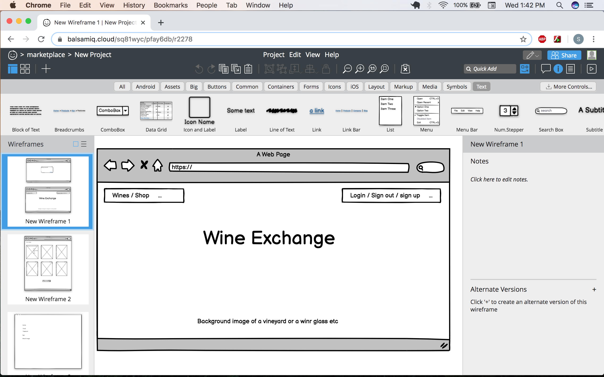
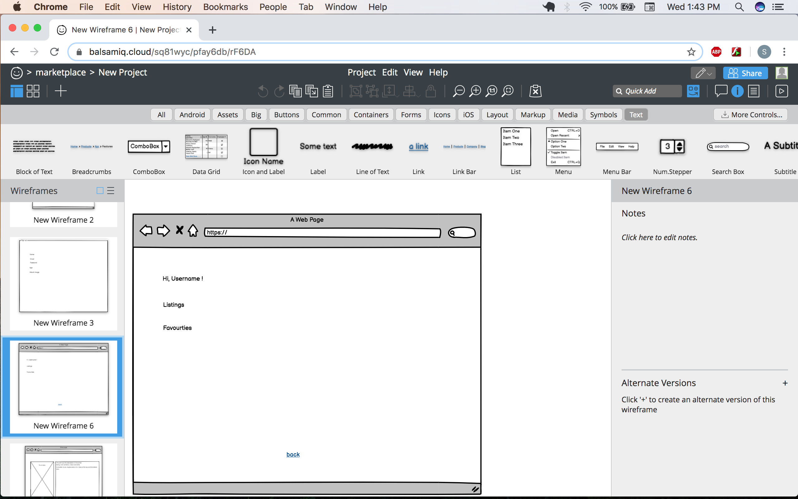

# README

# R7 Identification of the problem you are trying to solve by building this particular marketplace app.

Whilst thinking about implementing an app for this assignment , i wanted to help solve the problem that wine drinkers often have with their wines and keeping notes/description of the wines they have drunken and what they thought of the the particular wine and what the details of the specific wine were. I have had discussions with wine enthusiasts who have mentioned this and said that they kept notes, but mainly on Microsoft Excel, with no pictures and did not have the means to have it displayed in a manner that was more aesthetically pleasing. I ended up designing and implementing an app that adhered to this. I did not want, or did not implement a counter of each particular wine (something i can do in the future potentially) as i felt that the wine notes only applied to the singular bottle. 

# R8 Why is it a problem that needs solving?

Through the design process of this application , i was asking my Dad questions related to this ( he is a wine nut - has ~1000 bottles stored in the house, and all on excel!), and thought he would appreciate the ability to use an application in which he could store his wines, and keep a note about them, regarding tasting notes, a description about the wine, and the standard attributes that a wine has - its alcohol content, grape variety (sometimes there is more than one, i also kept this limited as there are roughly 10,000 grape varieties), a wine type, which i had to narrow down to just 5 for useability purposes, the size of the wine, and of course the price and a picture of the bottle. 

# R9 A link (URL) to your deployed app (i.e. website)

https://stormy-falls-83343.herokuapp.com/

# R10

https://github.com/Thadman/WineApp

# R11 Description of your marketplace app (website)

Purpose  - The purpose of this app is to help wine enthusiasts keep a log of the wines they have been drinking and keeping a note about them, regarding the tasting notes and keeping track of the other attributes that the particular wine has, a way in which they can look back on the wine and reminisce and have their memory jogged as to what the wine tasted like , and what they had paired the wine with. 
Functionality / features - The functionality of this application is rather simple, a user can sign up to the website and they are granted an account/profile. They can look through wines that have been listed by other users and add to the collection themselves. They can also then edit their listing, and god forbid anything unbelievable happens, they are also granted the god like authority of even deleting their own listed wine, which is possible to see in their profile, or in fact 'not' see in their profile anymore. Under the extremely unlikely circumstances they want nothing more to do with the application, they are also lucky enough ( or unlucky enough ) to delete their very own account. The user is also able to search the whole list of wines by name and view a particular wine, and then view this by itself , and here it is in fact their wine are also able to edit or delete it here as well. The website application has multiple features. This includes a navbar in which they can navigate the site through, a search bar in which the user can search for wines by name. A page in which they can register to the website, as well as a page that they can login. The site has a listings page in which the user can view all the wine listings that have been posted there. They also have the opportunity to 'view' the wines through a 'show' page, which contains just the wine itself with more details about the wine. The site also has user profiles in which the user can see the wines they have uploaded. they can also go to the show page from here as well. Another feature that i have implemented was a search bar for the wines, after searching you are taken to a page revealing the results of the search and you are able to click on the name of the wine and are taken to the show page again. The user also has the ability to view the pages by clicking next/previous, allowing for 6 listings per page to minimize scrolling for UX. The website also has the ability to return to the homepage at any stage with the brand in the top-right corner, using it as a link to the homepage. 
Target Audience - The target audience for this web application is anyone who has a vested interest in wine and wants to keep track of their experience of each wine and keep i detail what they thought of it. It is not catered to people younger than 18 of course ! 
Tech Stack - The tech stack i used for this application was Ruby and Ruby on Rails framework. I used Bootstrap for the front end, and CSS3 and HTML5. I used Heroku to deploy the application. For image upload i used an AWS S3 bucket.

# R12 - User stories for your app

1. As a lister i want to be able to delete my listing item so that i can delete an old wine
2. As a lister i want to be able to edit my listing item so that i can edit wine i may have made a mistake on
3. As a browser i want to be able to search the site for wines so people can see my listings
4. As a lister i want the ability to delete and edit to be hidden so people cant delete my item
5. As a lister i want to be able to login for security reasons so i can feel safe with the listings
6. As a browser i want to be able to make an account so i can join the online wine community
7. As a lister i want to be able to add to my wine collection so i can keep track of my wines
8. As a lister i want to be able to view all of my wines in a profile so i can get a visual representation of my wines
9. As a lister i want to be be able to upload pictures so i can see the wine bottle
10. As a lister i want to have attributes for my wine so i can correctly jot down them.

# R13  - Wireframes for your app

# R14  - An ERD for your app

# R15 - Explain the different high-level components (abstractions) in your app

An example of a high-level component in my rails application is Active Record. Active record accounts for the M in MVC, which is the model. This is responsible for the representation of the data. Active Record takes the data which is stored within a database of columns and rows and allows you to manipulate or retrieve the data. This means we are able to query the database with eg. Wine.all as opposed to using a SQL query line SELECT * FROM wine. Wine.all will give me the ability to 'play with' the objects that are 'wine'. Active Record also allows us to create Ruby objects that will in fact represent a row in one of the databases you have created. The Active Record inherits from ActionRecord::Base, and all other models inherit from Active Record. 

Another example of a high level component in Active Storage. Active storage allows for the uploading of files through a cloud storage system like the one used in this application (Amazon S3), it also attaches these files to the Ruby object. Through the use of Active storage in your Rails application you are able to uploads files and, if needed are able to generate representation of these.

A last example of a high level component in a Ruby app is the Action Controller. This is Responsible for the C in MVC, and is the controller. The action controller is at the core of the request when it is made in the rails app. The controller is made up of at least one, amd potentially more actions. These actions determine what is happening by interacting with the Active Record and then rendering a template in which can be viewed, it is also possible that it redirects to another action as well. The Action Controller inherits from ActionController::Base, and the other controllers inherit from ApplicationController, this inturn gives you one class in which you can make configurations. 

# R16 - Detail any third party services that your app will use

For this project i used Devise for authentication, allowing me to get a user to sign up to the website. This means users are able to make profiles and look at the website. And have the knowledge in the fact that it is secure with the login. I used the Cancancan gem to ensure authorization of the website. Making sure that only the person who owns the particular listing can edit or delete the entry. I also used the paginate gem to ensure minimal scrolling on the page. I used Amazon S3 for the uploading of images to ensure that it does not 'bog' down the page loading speed, having to load all the files. 

# R17 Describe your projects models in terms of the relationships (active record associations) they have with each other

In my app i have 7 models, 6 of which are my own and 1 which inherits these (application_record). My first model i made was the listing model, this model has the attributes that a wine carries. This model has a connection with every other model i created. With these associations, it makes it possible to connect these models together and to make common operations easier within the code. The Listing model has many relationships. These include a belongs_to relationship with the User - because a User has_many listings and the listings belong_to the User. The listing also belongs_to a wine_type, and a wine_type has_many listings - i used this relationship because a wine can only be one type, but a type of wine can have many listings. (wine type in this case i have kept ot just Red, White, Sparkling, Rose, and Dessert). The Listing model also has_one_attached picture to allow for the uploading images to identify the wine. I also have a join table grapelistings, as a wine can have multiple grape varieties and a grape variety can also have many listings. This was important because wine is such a diverse field and it was essential to use this in the creating of a new listing. I also have the Ability model which is implemented when Cancancan was added. This allows for the restrictions that can be placed on a user when they are interacting with the website. By placing the relationship in the model itself it then will be able to 'speak' to the other models regarding that particular relationship. 

# R18 Discuss the database relations to be implemented in your application

In my application i used 5 tables in my ERD which are using one of three database relations, belongs_to, has_many and many_to_many. Through these database relations it was possible to have wine listings that consist of multiple grapes and have the opportunity to choose between many types of wine. This was possible through the use of foreign keys in some cases, when the belongs_to is used fir example the foreign key will sit in that table to make the relationship possible. Each database has pairs of values that are loaded into them initially in the migration or they are added after with AddColumnToColumn and then you are able to have the attributes , for example , name:string. You are also able to add the reference in the migration as well, which then you are able to fulfill the full relationship in the model itself. You are also able to check this relationship is correct with the schema file before you migrate the file. It was also possible to have a User has_many listings and listing belongs_to a User. These relationships and the use of primary keys and foreign keys make it possible to have these database relations setup and the use of a visual ERD helps visualize it. 

# R19 Provide your database schema design

# R20 Describe the way tasks are allocated and tracked in your project

Through the process of designing and coding this project, i used trello to ensure nothing was forgotten, and i could keep notes and tabs on what needed to be fixed, and what was completed. I also was able to have potential ideas on my trello board , that if i had time at the end i would be able to try and implement these functions. I had 5 columns which i labelled 'To Do, Doing, Done, but can come back, Done, Fixes/maybe do. With these i was able to keep track of my project and during the day was able to add and move 'cards' around to their correct position on the table. I took a screen shot at the end of each day (i will just add 4)

